```
     *        .-""-.  *
 *        *  /___., \       *
     *      /`\____}()  *
        *  | 　n　n|       *
   *     /`   __'_/  *
*      /        |       *
    * /  ヽ     /
 *    │   |  | |  *      *
    /` ;  |  | |     *       *
___( \ __.\-,),,)________________
    \ )
```

# [Advent of Code 2023](https://adventofcode.com/)

- [x] Familiarize with some more [interesting](https://www.youtube.com/watch?v=D1twn9kLmYg) [Python](https://www.youtube.com/watch?v=m6asOJmfGpY) [language](https://www.youtube.com/playlist?list=PLdQruVCKu10k5p2lK04KJuKEeUuXOeH6F) [features](https://www.youtube.com/watch?v=T-TwcmT6Rcw)
    - generators: [day 5](2023/05/day05.py)
- [x] Re-famliarize with some Python type hints and type checking
    - fully typed: [day 3](2023/05/day03.py) and [day 5](2023/05/day05.py)
    - `pyright 2023/**/*.py`
- [x] Setup a convenient command runner for scaffolding/testing/solving, decoupled from languages (like [`just`](https://just.systems/) or [`task`](https://taskfile.dev/))
- [ ] ~~Solve 50 ⭐'s (not sure if I'm that invested this year...)~~

# [Advent of Code 2022](https://adventofcode.com/2022/)

- [x] Speedrun some of the problems in Javascript/TypeScript
- [x] Implement at least one non-trivial rust solution
- [x] Solve 25 ⭐'s

## Days

<!-- AOC TILES BEGIN -->
<h1 align="center">
  2023 - 10 ⭐
</h1>
<a href="2023/01/day1.py">
  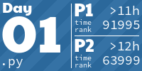
</a>
<a href="2023/02/day2.py">
  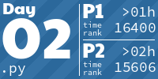
</a>
<a href="2023/03/day03.py">
  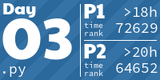
</a>
<a href="2023/04/day4.sh">
  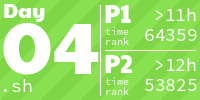
</a>
<a href="2023/05/day05.py">
  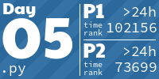
</a>
<h1 align="center">
  2022 - 26 ⭐
</h1>
<a href="2022/01/soln_calories.py">
  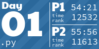
</a>
<a href="2022/02/soln_rps.js">
  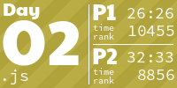
</a>
<a href="2022/03/soln_bags.js">
  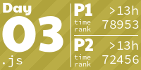
</a>
<a href="2022/04/soln_cleaning.js">
  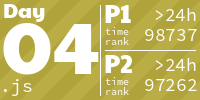
</a>
<a href="2022/05/soln_towers.js">
  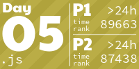
</a>
<a href="2022/06/soln_markers.js">
  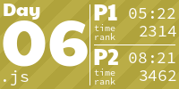
</a>
<a href="2022/07/07.rs">
  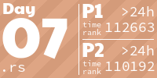
</a>
<a href="2022/10/soln_pixels.js">
  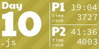
</a>
<a href="None">
  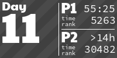
</a>
<a href="None">
  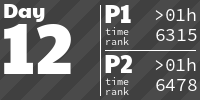
</a>
<a href="None">
  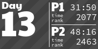
</a>
<a href="None">
  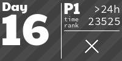
</a>
<a href="None">
  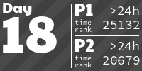
</a>
<a href="None">
  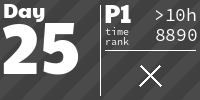
</a>
<!-- AOC TILES END -->

Credit to LiquidFun for their [info tile implementation](https://github.com/LiquidFun/adventofcode/blob/main/AoCTiles/README.md)!
